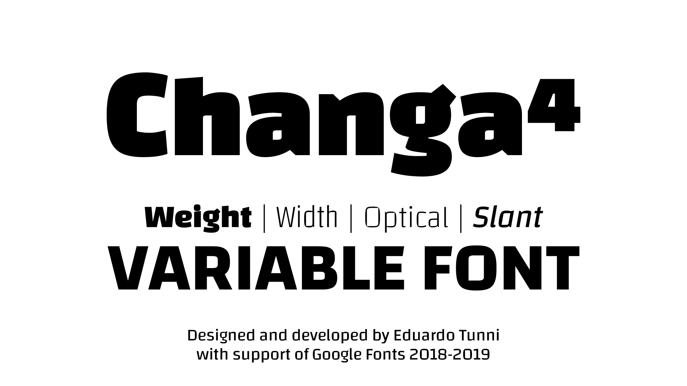

# Changa

Changa is a typeface family intended for headlines, titles and other display settings and supports the Latin and Arabic scripts.

The Latin was developed with a singular height so that you can create display texts with minimum line spacing. The lowercase has short ascenders and descenders and the letters are inscribed within a square. The uppercase is also sturdy and squat. The counter shapes are rectangular, featuring small curves in opposite vertexes which accompany and break the shapes, evoking a contemporary style. Now redesigned with the advantages of variable font technology.

## Variable Axes

Pathway is still being built, but it will have the following axes:

| Axis       | Tag    | Range        | Default | Description
| ---------- | ------ | ------------ | ------- | ---------------------------------------------------------------
| Weight     | `wgth` | 50 to 220    | 50      | Thin to Black -nine static weights-
| Width      | `wdth` | 75 to 100    | 75      | Thin to Black -nine static weights-
| Optical    | `opsz` | 12 to 144    | 12      | 
| Slant      | `slnt` | 0 to 10      | 0       | Some glyphs are changed to single story when sl>5 like a and g                             |

(...to be continued) -->

## Collaborators 

- Adam Twardoch and FontLab team

+ Many other advisors and reviewers
